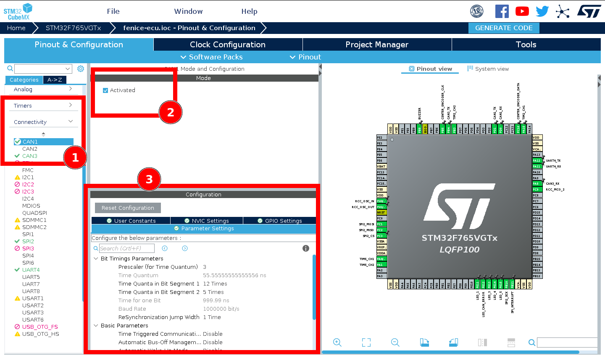
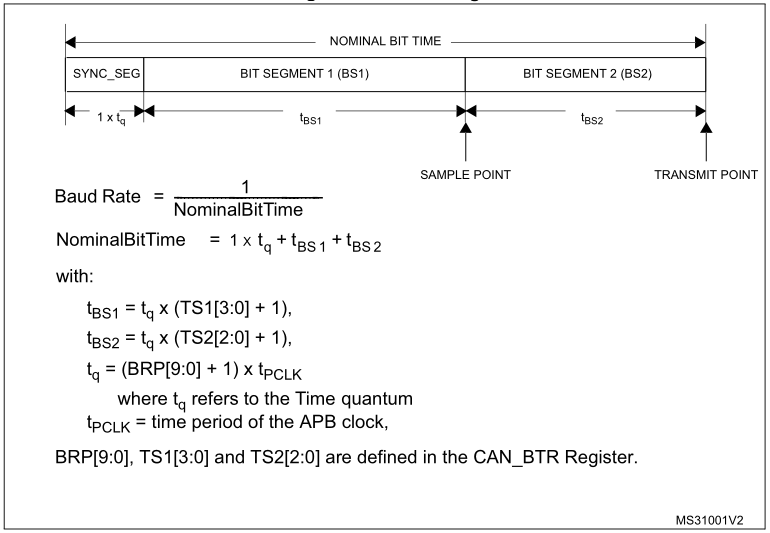
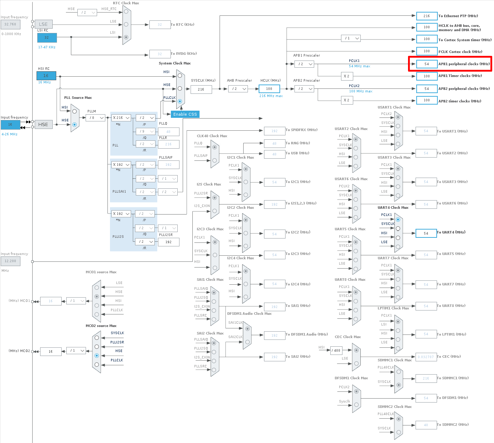
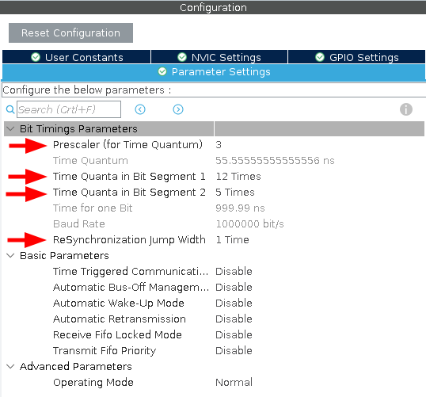
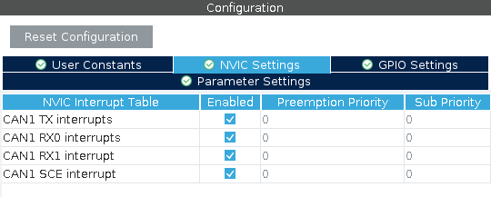
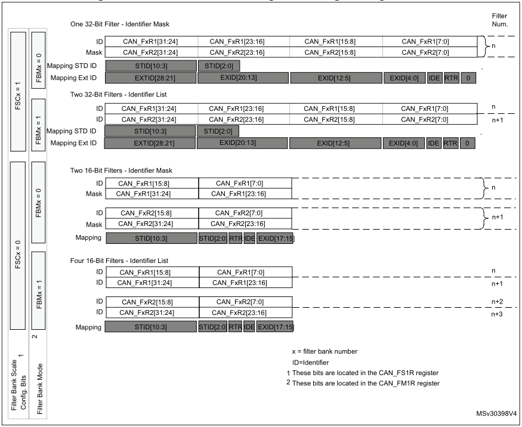

# Configuring of the CAN-bus on ST MCUs

## On CubeMX
#### Activate the Peripheral
In CubeMX, expand the "Connectivity" tab on the left pane and click on the CAN interface you wish to activate. A configuration pane will appear on the right; tick the "Activated" checkbox.



#### Set the Bit Timing Parameters
The sampling of the signal is dictated by a number of parameters that set time constraints for the reading and transmitting instants. The duration of a bit (nominal bit time) is split into four segments: a synchronization segment (SYNC_SEG) to sync all nodes on the network, the first Bit Segment (BS1) to define the location of the sampling point, the second Bit Segment to define the transmit point (BS2), and a resynchronization Jump Width (SJW) that indicates how much segments can be lengthened or shortened to compensate for timing errors or delays. The length of these segments is defined in terms of number of Time Quanta ($t_q$). For a visual representation of the subdivision and the mapping of the values to the registers refer to the image below.



To define the duration of a time quanta and the length of the various segments, you need to input your parameters into the "Configuration" panel that appeared in CubeMx from the previous step (below the "Activate" checkbox"). If your parameters are still to be defined, use an online calculator such as [bittiming.can-wiki.info](http://www.bittiming.can-wiki.info/) and fill the form; note that selecting the platform is only needed if you're interested in the register mapping, but in any case this website provides a choice for "ST Microelectronics bxCAN" which is our case. Input the clock frequency after checking your Clock Tree in CubeMX for how the relevant bus is configured (in the example below, the bxCAN peripheral is connected to the APB1 bus which is at 54 MHz) and of course that the frequency is high enough to operate at the target link speed.



Next, input the desired sample point (the default 87.5% is fine), the SJW duration (the default 1 is fine as well), and the desired bitrate **in kbit/s**. The calculator will generate a table with valid combinations: copy over the values into CubeMX for the Prescaler, BS1, and BS2 (SYNC_SEG is always of length 1 $t_q$) and check that the resulting baud rate is correct.



The last operation left to perform in CubeMX is to activate all CAN interrupts in the NVIC array: in the same panel as above, switch to the "NVIC" tab and tick all checkboxes.



## In Your Code
Most of the information that follows is available in the source documentation of the `stm32fXxx_hal_can.c` driver file, so check there should you need any additional detail. However, much of the process outlined there is handled automatically by CubeMX, so this document should simplify your setup by only describing what has effectively to be done, while also using a less schematic and cryptic approach.

#### Create the Callback Functions
To register callbacks you need to create the relative functions with the proper names (in the form of `HAL_CAN_xxxCallback(...)`).

| Callback signature                                             | Action upon which it is invoked |
|----------------------------------------------------------------|---------------------------------|
| `void HAL_CAN_RxFifo0MsgPendingCallback(CAN_HandleTypeDef *)`  | A message has been received into FIFO 0 and is ready to be read. |
| `void HAL_CAN_RxFifo1MsgPendingCallback(CAN_HandleTypeDef *)`  | A message has been received into FIFO 1 and is ready to be read. |
| `void HAL_CAN_RxFifo0FullCallback(CAN_HandleTypeDef *)`        | FIFO 0 has reached its full capacity. The next RX will cause an overrun error. |
| `void HAL_CAN_RxFifo1FullCallback(CAN_HandleTypeDef *)`        | FIFO 1 has reached its full capacity. The next RX will cause an overrun error. |
| `void HAL_CAN_TxMailbox0CompleteCallback(CAN_HandleTypeDef *)` | Mailbox 0 is now clear (a pending TX has ended). |
| `void HAL_CAN_TxMailbox1CompleteCallback(CAN_HandleTypeDef *)` | Mailbox 1 is now clear (a pending TX has ended). |
| `void HAL_CAN_TxMailbox2CompleteCallback(CAN_HandleTypeDef *)` | Mailbox 2 is now clear (a pending TX has ended). |
| `void HAL_CAN_ErrorCallback(CAN_HandleTypeDef *)`              | An error in the peripheral has occurred. **Make sure to properly log the raised error code.** |

!!! example
    For you convenience, here is a prepared Error Callback that verbosely logs any error bit that is high in the error code. `CAN_error_handler(...)` is a custom sample function that prints the message over UART and lights up a red LED.

    ```C
    void HAL_CAN_ErrorCallback(CAN_HandleTypeDef *hcan) {
        uint32_t e = hcan->ErrorCode;

        if (e & HAL_CAN_ERROR_EWG)
            CAN_error_handler("Protocol Error Warning");
        if (e & HAL_CAN_ERROR_EPV)
            CAN_error_handler("Error Passive");
        if (e & HAL_CAN_ERROR_BOF)
            CAN_error_handler("Bus-off Error");
        if (e & HAL_CAN_ERROR_STF)
            CAN_error_handler("Stuff Error");
        if (e & HAL_CAN_ERROR_FOR)
            CAN_error_handler("Form Error");
        if (e & HAL_CAN_ERROR_ACK)
            CAN_error_handler("ACK Error");
        if (e & HAL_CAN_ERROR_BR)
            CAN_error_handler("Bit Recessive Error");
        if (e & HAL_CAN_ERROR_BD)
            CAN_error_handler("Bit Dominant Error");
        if (e & HAL_CAN_ERROR_CRC)
            CAN_error_handler("CRC Error");
        if (e & HAL_CAN_ERROR_RX_FOV0)
            CAN_error_handler("FIFO0 Overrun");
        if (e & HAL_CAN_ERROR_RX_FOV1)
            CAN_error_handler("FIFO1 Overrun");
        if (e & HAL_CAN_ERROR_TX_ALST0)
            CAN_error_handler("Mailbox 0 TX failure (arbitration lost)");
        if (e & HAL_CAN_ERROR_TX_TERR0)
            CAN_error_handler("Mailbox 0 TX failure (tx error)");
        if (e & HAL_CAN_ERROR_TX_ALST1)
            CAN_error_handler("Mailbox 1 TX failure (arbitration lost)");
        if (e & HAL_CAN_ERROR_TX_TERR1)
            CAN_error_handler("Mailbox 1 TX failure (tx error)");
        if (e & HAL_CAN_ERROR_TX_ALST2)
            CAN_error_handler("Mailbox 2 TX failure (arbitration lost)");
        if (e & HAL_CAN_ERROR_TX_TERR2)
            CAN_error_handler("Mailbox 2 TX failure (tx error)");
        if (e & HAL_CAN_ERROR_TIMEOUT)
            CAN_error_handler("Timeout Error");
        if (e & HAL_CAN_ERROR_NOT_INITIALIZED)
            CAN_error_handler("Peripheral not initialized");
        if (e & HAL_CAN_ERROR_NOT_READY)
            CAN_error_handler("Peripheral not ready");
        if (e & HAL_CAN_ERROR_NOT_STARTED)
            CAN_error_handler("Peripheral not strated");
        if (e & HAL_CAN_ERROR_PARAM)
            CAN_error_handler("Parameter Error");
    }
    ```

#### Activate the IRQ Handlers ("Notifications")
At this point, in order for the code to actually invoke your callbacks, you need to activate the relative so-called Notifications with `HAL_CAN_ActivateNotification(CAN_HandleTypeDef *, uint32_t)`. Possible values for the IRQ number are, as defined in the driver file:

```C
/* Transmit Interrupt */
#define CAN_IT_TX_MAILBOX_EMPTY     ((uint32_t)CAN_IER_TMEIE)   /*!< Transmit mailbox empty interrupt */

/* Receive Interrupts */
#define CAN_IT_RX_FIFO0_MSG_PENDING ((uint32_t)CAN_IER_FMPIE0)  /*!< FIFO 0 message pending interrupt */
#define CAN_IT_RX_FIFO0_FULL        ((uint32_t)CAN_IER_FFIE0)   /*!< FIFO 0 full interrupt            */
#define CAN_IT_RX_FIFO0_OVERRUN     ((uint32_t)CAN_IER_FOVIE0)  /*!< FIFO 0 overrun interrupt         */
#define CAN_IT_RX_FIFO1_MSG_PENDING ((uint32_t)CAN_IER_FMPIE1)  /*!< FIFO 1 message pending interrupt */
#define CAN_IT_RX_FIFO1_FULL        ((uint32_t)CAN_IER_FFIE1)   /*!< FIFO 1 full interrupt            */
#define CAN_IT_RX_FIFO1_OVERRUN     ((uint32_t)CAN_IER_FOVIE1)  /*!< FIFO 1 overrun interrupt         */

/* Operating Mode Interrupts */
#define CAN_IT_WAKEUP               ((uint32_t)CAN_IER_WKUIE)   /*!< Wake-up interrupt                */
#define CAN_IT_SLEEP_ACK            ((uint32_t)CAN_IER_SLKIE)   /*!< Sleep acknowledge interrupt      */

/* Error Interrupts */
#define CAN_IT_ERROR_WARNING        ((uint32_t)CAN_IER_EWGIE)   /*!< Error warning interrupt          */
#define CAN_IT_ERROR_PASSIVE        ((uint32_t)CAN_IER_EPVIE)   /*!< Error passive interrupt          */
#define CAN_IT_BUSOFF               ((uint32_t)CAN_IER_BOFIE)   /*!< Bus-off interrupt                */
#define CAN_IT_LAST_ERROR_CODE      ((uint32_t)CAN_IER_LECIE)   /*!< Last error code interrupt        */
#define CAN_IT_ERROR                ((uint32_t)CAN_IER_ERRIE)   /*!< Error Interrupt                  */
```

Note that IRQ numbers can be OR-ed together and be activated many at once. For instance:

```C
HAL_CAN_ActivateNotification(hcan,
    CAN_IT_ERROR_WARNING |
    CAN_IT_ERROR_PASSIVE |
    CAN_IT_BUSOFF |
    CAN_IT_LAST_ERROR_CODE |
    CAN_IT_ERROR
);
```

#### Activate and Configure the Hardware Filters
When a new message is received, CAN nodes can use hardware filters to decide if the message must be copied into SRAM and trigger an IRQ, or if it has to be discarded. The advantage of hardware filters is that unwanted messages don't waste any CPU cycles thus saving potentially a lot of resources, especially on heavy traffic networks with many nodes.

STMs are equipped with a number of filter banks, each of which is composed by two 32-bit registers. Each bank can operate in **ID Mask Mode** or in **ID List Mode**: in the former, one register acts as the mask and the second as the ID, while in the latter mode, both registers represent IDs of the list. Filter banks can also be configured to operate in 16-bit mode, therefore doubling their capacity (four 16-bit registers instead of two 32-bit registers, which are split in two). In ID Mask mode this yields two pairs of Mask+ID, while in ID List mode, of course, it yields 4 ID registers.

For a better understanding of the layout of a filter bank in relation to hardware registers, refer to the image below.



##### ID Mask Mode
In this mode the filtering is based on a mask register which tells which bits of the ID register need to be compared with the incoming message ID. For instance, with a mask of `11110000000` and an ID of `01110000000`, only messages whose ID begins with `0111` (`0x3`) will be accepted. Some more examples follow.

!!! example
    - Mask: `0b11111111111` (`0x03FF`) <br/>
      ID: `0b11111111111` (`0x03FF`) <br/>
      Accepted: only ID == `0x03FF`

    - Mask: `0b11111111110` (`0x03FE`) <br/>
      ID: `0b11111111110` (`0x03FE`) <br/>
      Accepted: {`0x03FE`, `0x03FF`} (as bit 0 of the filter is disabled)

     - Mask: `0b11111111000` (`0x03F8`) <br/>
       ID: `0b00000000000` (`0x0000`) <br/>
       Accepted: ID from `0x000` to `0x007` (as bits 0, 1, 2 of the filter are disabled)

##### ID List Mode
In ID List Mode, incoming messages' IDs are simply compared for equality with every element of the list.

##### Code
To configure a filter, you need to allocate and populate a `CAN_FilterTypeDef` struct and pass it by reference to `HAL_CAN_ConfigFilter(...)`. Its fields are the following:

- `FilterMode`: either `CAN_FILTERMODE_IDMASK` or `CAN_FILTERMODE_IDLIST`, for the respective modes
- `FilterIdHigh`: MSBs of the ID register (or first one of the two 16-bit registers)
- `FilterIdLow`: LSBs of the ID register (or second one of the two 16-bit registers)
- `FilterMaskIdHigh`: MSBs of the Mask register (or first one of the two 16-bit registers)
- `FilterMaskIdLow`: LSBs of the Mask register (or second one of the two 16-bit registers)
- `FilterFIFOAssignment`: the queue in which to store messages (a value of `CAN_filter_FIFO`, e.g. `CAN_FILTER_FIFO0`)
- `FilterBank`: index of the filter bank to be initialized
- `FilterScale`: `CAN_FILTERSCALE_16BIT` or `CAN_FILTERSCALE_32BIT`, for the respective register scale
- `FilterActivation`: `ENABLE` or `DISABLE`

!!! example
    A filter that accepts everything would look like this:

    ```C
    CAN_FilterTypeDef f;
    f.FilterMode = CAN_FILTERMODE_IDMASK;
    f.FilterIdLow = 0x0;  // Meaningless, mask is all 0s
    f.FilterIdHigh = 0x0; // Meaningless, mask is all 0s
    f.FilterMaskIdHigh = 0x0;
    f.FilterMaskIdLow = 0x0;
    f.FilterFIFOAssignment = CAN_FILTER_FIFO0;
    f.FilterBank = 0;
    f.FilterScale = CAN_FILTERSCALE_32BIT;
    f.FilterActivation = ENABLE;

    HAL_CAN_ConfigFilter(hcan, &f);
    ```

#### Final Operations
The last step is to actually start the peripheral by calling `HAL_CAN_Start(...)`. To use it, send messages with `HAL_CAN_AddTxMessage(...)` after checking for free mailboxes with `HAL_CAN_GetTxMailboxesFreeLevel(...)` and read received messages with `HAL_CAN_GetRxMessage(...)`.

Should anything not work properly, refer to the next document, [CAN-bus Troubleshooting](can-debugging.md).
