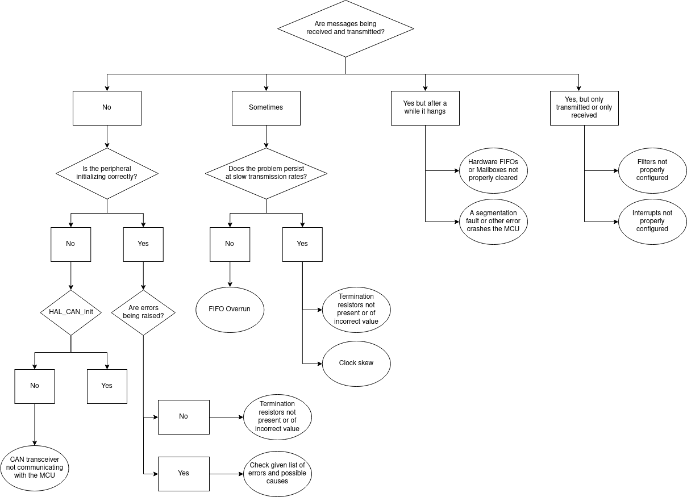
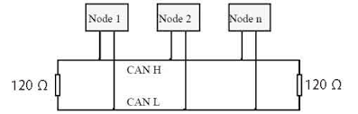

# CAN-bus Troubleshooting

## Step 1: Check Your Configuration
Check that you CubeMX configuration and you code precisely match what is detailed in [CAN-bus Configuration](can-config.md).

!!! warning
    Be sure to activate all error interrupts and log them properly, otherwise you'll have no way of knowing what is failing and how to fix it.

## Step 2: Follow This Flowchart
Find your problem in the flowchart below and more details on the next chapter.



## Step 3: Find More Details From The Flowchart
Look for the paragraph regarding your problem and read through.

#### CAN Transceiver not communicating with the MCU
While the CAN bus operates on two differential lines, the MCU uses a serial protocol, for which a transceiver is needed (for instance, an MCP2562) that translates the CAN_H and CAN_L signals into CAN_TX and CAN_RX. Absence of communication with this device cause the `HAL_CAN_Start` call to fail with a timeout error.

!!! check
    Check continuity between all relevant pins of the transceiver, the CAN socket, and the MCU pins. Try swapping the transceiver with a new one.

---

#### Termination resistors not present or of incorrect value



On a CAN network it is very important that the bus is terminated on both sides by a 120 $\Omega$ resistor ([interesting article on why](https://e2e.ti.com/blogs_/b/industrial_strength/posts/the-importance-of-termination-networks-in-can-transceivers)). Also note that some devices might already incorporate a termination resistor on their end, so pay attention at how many you put.

!!! check
    Verify that resistors are properly connected to the bus and are of the correct value. Check schematics and datasheets for already-present termination resistors on the connected nodes. Use an oscilloscope to ensure that the quality of the signal is good.

---

#### List of errors raised by the HAL library
CAN errors are defined in the driver file `stm32f7xx_hal_can.h` as follows:

```C
#define HAL_CAN_ERROR_NONE            (0x00000000U)  /*!< No error                                             */
#define HAL_CAN_ERROR_EWG             (0x00000001U)  /*!< Protocol Error Warning                               */
#define HAL_CAN_ERROR_EPV             (0x00000002U)  /*!< Error Passive                                        */
#define HAL_CAN_ERROR_BOF             (0x00000004U)  /*!< Bus-off error                                        */
#define HAL_CAN_ERROR_STF             (0x00000008U)  /*!< Stuff error                                          */
#define HAL_CAN_ERROR_FOR             (0x00000010U)  /*!< Form error                                           */
#define HAL_CAN_ERROR_ACK             (0x00000020U)  /*!< Acknowledgment error                                 */
#define HAL_CAN_ERROR_BR              (0x00000040U)  /*!< Bit recessive error                                  */
#define HAL_CAN_ERROR_BD              (0x00000080U)  /*!< Bit dominant error                                   */
#define HAL_CAN_ERROR_CRC             (0x00000100U)  /*!< CRC error                                            */
#define HAL_CAN_ERROR_RX_FOV0         (0x00000200U)  /*!< Rx FIFO0 overrun error                               */
#define HAL_CAN_ERROR_RX_FOV1         (0x00000400U)  /*!< Rx FIFO1 overrun error                               */
#define HAL_CAN_ERROR_TX_ALST0        (0x00000800U)  /*!< TxMailbox 0 transmit failure due to arbitration lost */
#define HAL_CAN_ERROR_TX_TERR0        (0x00001000U)  /*!< TxMailbox 0 transmit failure due to transmit error   */
#define HAL_CAN_ERROR_TX_ALST1        (0x00002000U)  /*!< TxMailbox 1 transmit failure due to arbitration lost */
#define HAL_CAN_ERROR_TX_TERR1        (0x00004000U)  /*!< TxMailbox 1 transmit failure due to transmit error   */
#define HAL_CAN_ERROR_TX_ALST2        (0x00008000U)  /*!< TxMailbox 2 transmit failure due to arbitration lost */
#define HAL_CAN_ERROR_TX_TERR2        (0x00010000U)  /*!< TxMailbox 2 transmit failure due to transmit error   */
#define HAL_CAN_ERROR_TIMEOUT         (0x00020000U)  /*!< Timeout error                                        */
#define HAL_CAN_ERROR_NOT_INITIALIZED (0x00040000U)  /*!< Peripheral not initialized                           */
#define HAL_CAN_ERROR_NOT_READY       (0x00080000U)  /*!< Peripheral not ready                                 */
#define HAL_CAN_ERROR_NOT_STARTED     (0x00100000U)  /*!< Peripheral not started                               */
#define HAL_CAN_ERROR_PARAM           (0x00200000U)  /*!< Parameter error                                      */
```

In general, bus-related and protocol-related errors (**protocol error warning, error passive, bus-off, stuff error, form error, ACK error, bit dominant, bit recessive, CRC error**) indicate either an electric problem with the wiring, or an underlying issue with the clock precision or frequency.

!!! check
    Double check with a multimeter that the bus is wired properly and that any jumpers make good contact. Use an oscilloscope to ensure that the signal is clear from interference and edges are sharp. Connect a logic analyzer to better understand the communication issue at binary level. See the [Clock Skew](#clock-skew) section and double-check that the configured frequencies match the oscillators.

Firmware-related errors such as overruns or transmit failures may instead indicate an overly congested network or a mistake by the developer when invoking low-level API calls.

!!! check
    Test your device with less traffic to ensure that the performance of the MCU is suitable for the application. If you are using only two devices, try connecting a third one to better understand where and how the errors generate. Carefully compare your code with the HAL and ST application notes.

---

#### Clock Skew
ST's MCUs incorporate an internal low-cost 16MHz crystal (called HSI in the clock tree - *High Speed Internal*) which is factory calibrated with a precision up to 1%. However, due to its low accuracy especially with temperature variations of the chip, peripherals can often encounter timing problems, in particular if running at higher frequencies generated by the PLL.

!!! check
    Set-up an external crystal (HSE) and configure the MCU for the correct frequency. Check at runtime that the HSI is not being used as a fallback after a configuration error with a condition like `if (__HAL_RCC_GET_SYSCLK_SOURCE() == RCC_SYSCLKSOURCE_HSE)`.

---

#### Hardware FIFOs or Mailboxes are not properly cleared
For MCUs with transmissions managed via mailboxes, the developer enqueues a new message to send by calling `HAL_CAN_AddTxMessage(...)` and providing as a last argument the address of a `uint32_t` variable in which the function will store the ID of the first free mailbox found. Errors may arise in two occasions: either the function is being called so frequently that the bus has no time to send and empty a slot, or no one is listening on the bus and the "Automatic Retransmission" option is set, making the MCU hang in a loop where it unsuccessfully tries to send messages over and over again.

Conversely, reception queues might as well fill up and cause overruns if they are not read often enough or the network is so congested that the MCU cannot keep up.

!!! warning
    When a CAN message arrives and its ISR is triggered, remember to call `HAL_CAN_GetRxMessage(...)` to clear the reception slot, otherwise an overrun will occur after few messages.

!!! check
    If errors happen when transmitting, make sure you are not sending too frequently and either have free mailboxes available (check with `HAL_CAN_GetTxMailboxesFreeLevel(...)`) or a software queue to temporarily store your pending packets.

    If instead they happen upon reception, test your code with as little incoming traffic as possible and try to understand if your MCU and your software architecture match the intended network performance. Always remember to also properly configure your hardware filters in order to only process what's necessary and not waste resources and CPU cycles.

---

#### A segmentation fault or other error crashes the MCU
The ST drivers and HAL library are generally very solid, so I advise to thoroughly check your code for memory leaks (if the MCU runs out of memory it simply stops) or possible sources of segmentation faults such as handling of pointers or calls to low-level functions like `memcpy` and such. Remember that if the firmware crashes you won't see any error message printed over serial, the processor will just freeze and stop.

!!! check
    Print debug statements over UART or blink on-board LEDs to make sure your code keeps executing or, in fact, stops after a while. Use your IDE built-in debugging tools to interface with OpenOCD and find the exact instruction on which the crash happens.

---

#### Filters not configured properly
If a message is discarded by a hardware filter you will not receive interrupts of any kind.

!!! warning
    Disabling filters will cause every message to be discarded, contrary to what you might expect.

!!! check
    Carefully read the filter configuration section in [CAN-bus Configuration](can-config.md) and ensure your filters are behaving as you intend.

---

#### Interrupts not configured properly
For interrupts to be raised by the MCU, they need to be properly configured both from CubeMX and in your code.

!!! check
    Verify that you followed the correct procedure detailed in the Interrupt section in [CAN-bus Configuration](can-config.md).
