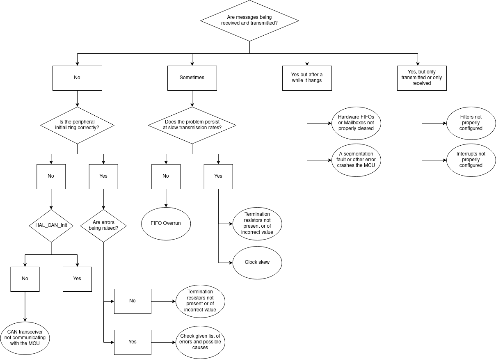

# CAN-bus Troubleshooting

## Step 1: Check Your Configuration
[...]

## Step 2: Follow This Flowchart
Find your problem in the flowchart below and more details on the next chapter.

## Step 3: Find More Details From The Flowchart
Look for the paragraph regarding your problem and read through.

#### CAN Transceiver not communicating with the MCU
While the CAN bus operates on two differential lines, the MCU uses a serial protocol, for which a transceiver is needed (for instance, an MCP2562) that translates the CAN_H and CAN_L signals into CAN_TX and CAN_RX. Absence of communication with this device cause the `HAL_CAN_Start` call to fail.

!!! check
    Check continuity between all involved pins. Try swapping the transceiver with a new one.

---

#### Termination resistors not present or of incorrect value

On a CAN network it is very important that the bus is terminated on both sides by a 120 $\Omega$ resistor ([interesting article on why](https://e2e.ti.com/blogs_/b/industrial_strength/posts/the-importance-of-termination-networks-in-can-transceivers)). Also note that some devices might already incorporate a termination resistor on their end, so pay attention at how many you put.

!!! check
    Verify that resistors are properly connected to the bus and are of the correct value. Check schematics and datasheets for already-present termination resistors on the connected nodes. Use an oscilloscope to ensure that the quality of the signal is good.

---

#### List of errors raised by the HAL library
[...]

---

#### Clock Skew
ST's MCUs incorporate an internal low-cost 16MHz crystal (called HSI in the clock tree - *High Speed Internal*) which is factory calibrated with a precision up to 1%. However, due to its low accuracy especially with temperature variations of the chip, peripherals can often encounter timing problems, in particular if running at higher frequencies generated by the PLL.

!!! check
    Set-up an external crystal (HSE) and configure the MCU for the correct frequency. Check at runtime that the HSI is not being used as a fallback after a configuration error with a condition like `if (__HAL_RCC_GET_SYSCLK_SOURCE() == RCC_SYSCLKSOURCE_HSE)`.

---

#### Hardware FIFOs or Mailboxes are not properly cleared
[...]

---

#### A segmentation fault or other error crashes the MCU
[...]

---

#### Filters not configured properly
[...]

---

#### Interrupts not configured properly
[...]
